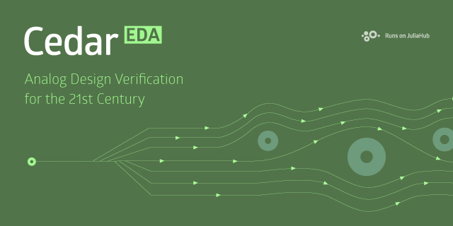

<a name="logo"/>

</img>

</a>

> [!WARNING]
> The public release of Cedar is ongoing. You are welcome to look around, but things will be unstable and various pieces may be missing. If you are not feeling adventurous, please check back in a few weeks.

Welcome to CedarEDA. Cedar is a modern green-field EDA stack, currently focused on analog design verification. You may find the Cedar source code in a number of packages at https://github.com/CedarEDA. This package (CedarEDA.jl) is the integration package. It provides high level APIs for various common tasks, end-to-end examples, as well as the code to build production images for juliahub.com (both commerical and open source versions).

To get started, please see the documentation at https://help.juliahub.com/cedareda/. You may also be interested in exploring various component packages:

- [CedarSim](https://github.com/CedarEDA/CedarSim.jl) is our fast analog simulator
- [CedarWaves](https://github.com/CedarEDA/CedarWaves.jl) is our waveform processing framework
- The documentation (https://help.juliahub.com/cedareda/) has a rendered version of the examples gallery (`examples` in this package). Live versions are also available in the public juliahub.com image.
- To get started with designing your circuit in a particular PDK, please see the PDK-specific documentation: [Skywater 130nm](https://github.com/CedarEDA/Sky130PDK.jl) or [GF 180nm](https://github.com/CedarEDA/GF180MCUPDK.jl)

# License / Contributing

The Cedar EDA platform is dual-licensed under a commercial license and CERN-OHL-S v2. In addition, some packages (including this one) are also available under the MIT license. Please see the LICENSE file for more
information and the LICENSE.FAQ.md file for more information on how to
use Cedar under the CERN-OHL-S v2 license.

We are accepting PRs on all Cedar repositories, although you must sign the Cedar Contributor License Agreement (CLA) for us to be able to incorporate your changes into the upstream repository. Additionally, if you would like to make major or architectural changes, please discuss this with us *before* doing the work. Cedar is a complicated piece of software, with many moving pieces, not all of which are publicly available. Because of this, we may not be able to take your changes, even if they are correct and useful (so again, please talk to us first).
