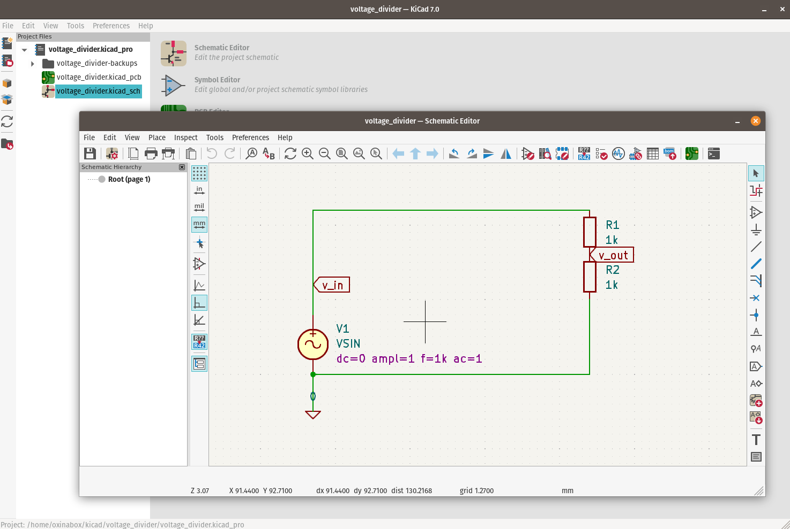
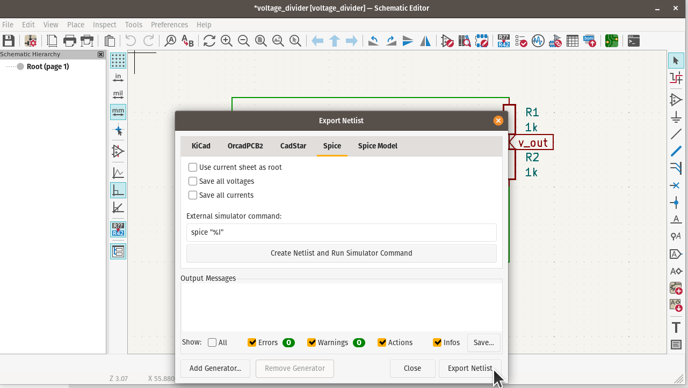
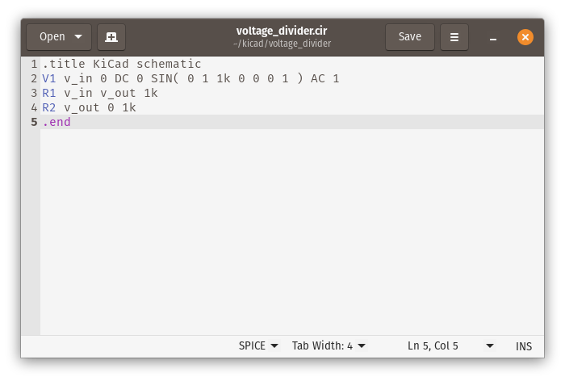
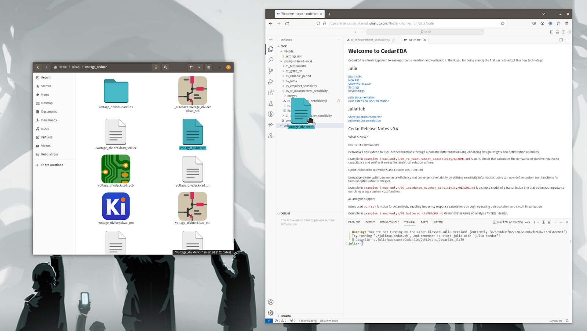

# Importing Schmatics designed using KiCAD into CedarEDA

#### 1. Open KiCaD Schematic Editor and create or load your circuit schematic.

#### 2. Go to: **File** → **Export** → **Netlist…**, and select the **Spice** tab.

#### 3. Click **Export Netlist** and save the file your preferred location.
You will now have a `.cir` file you can open in a text editor.

#### 4. Open the CedarEDA app on JuliaHub. **Drag and drop** the `.cir` file into the folder of your choice in the Explore pane of VS-Code

#### 5. You can now interact with that circuit definition and run simulations upon it using a `SimManager`. E.g. `sm = SimManager(joinpath(@__DIR__, "voltage_divider.cir"))`.
