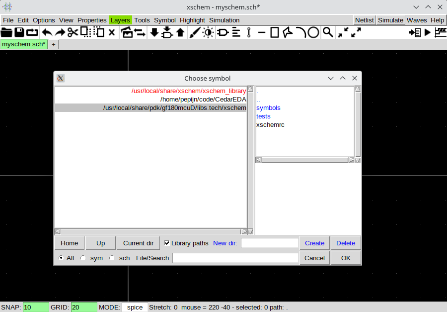
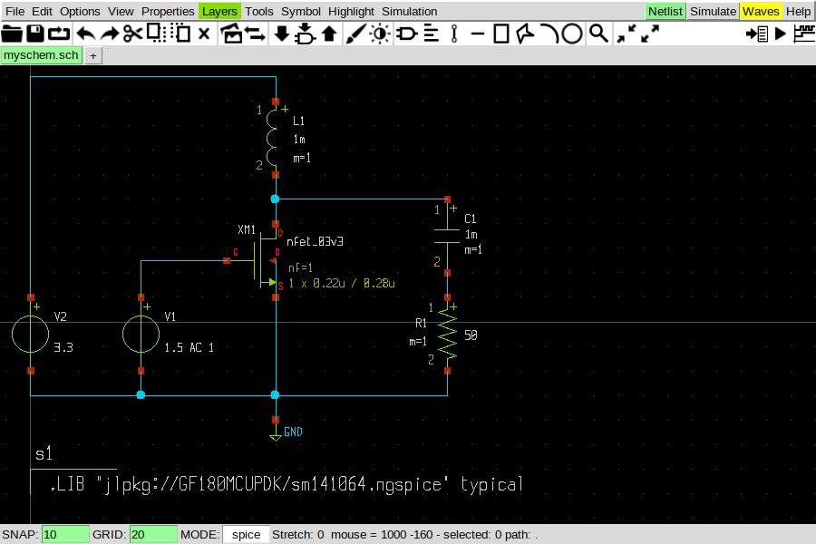

# Designing and simulating with xschem

Xschem is one of the more popular schematic editors for open source PDKs, with device symbols being included with the PDK.
Unlike KiCAD, it is developed with IC design in mind, making it more suitable for nontrivial designs.
It is also able to export spice netlists that can be used with CedarEDA.
Here is how.

## Installation

The easiest way to install xschem files for one of the open source PDKs is to use [open_pdks](http://opencircuitdesign.com/open_pdks/), a collection of build scripts to download, patch, and install the PDK on your machine.

For the most up-to-date information, check the link above, but the gist of it is

```bash
git clone https://github.com/RTimothyEdwards/open_pdks
cd open_pdks
./configure --enable-gf180mcu-pdk # or --enable-sky130-pdk
make
sudo make install
make veryclean
```

This will install the PDK in `/usr/local/share/pdk`

Next, we need to [install xschem](https://xschem.sourceforge.io/stefan/xschem_man/install_xschem.html), making sure to get a recent version.
At the time of writing, the Ubuntu package is too old and will not work.

The safest bet is to build from source.
Again, for the most up-to-date information check the above link, but the gist of it is

```bash
git clone https://github.com/StefanSchippers/xschem.git xschem-src
cd xschem-src
./configure
make
sudo make install
```

## Design

Launch xschem with the `rcfile` option pointing to the `xschemrc` that came with the PDK of choice. This will set up the paths to PDk devices symbols and related configurations.

```bash
xschem --rcfile /usr/local/share/pdk/gf180mcuD/libs.tech/xschem/xschemrc myschem.sch
```

Now press `Ins` to bring up the device window. You'll see `xschem_library` with ideal devices like voltage sources ande resistors, the current folder, and a PDK folder with symbols for its device models.



It is worth checking out the [manual](https://xschem.sourceforge.io/stefan/xschem_man/xschem_man.html), but here are some bare essentials:

- `Ins` to insert devices
- `m` to move the selected elements
- `q` to open device properties
- `w` to start drawing a wire or make a corner

That should be enough to draw a minimal circuit. Two crucial tips to prepare for simulation:

- Don't foget a ground node, it's called `gnd` in the `xschem_library` folder.
- You'll need to add a `code` or `code_shown` element to actually include the PDK.

To do the latter
1. Press `Ins` to insert a `code_shown` element
2. Select it and press `q` to open properties
3. Change `Edit attr` to `value`
4. Insert the following code

For GF180
```spice
.LIB "jlpkg://GF180MCUPDK/sm141064.ngspice" typical
```

For Sky130
```spice
.lib "jlpkg://Sky130PDK/sky130.lib.spice" tt
```

The end result could look something like this


## Simulation

To generate a suitable spice netlist, first select `Simulation -> Set netlist Dir` and after selecting a location press the `Netlist` button in the top right.

From there you can drag-and-drop this netlist into the VSCode explorer pane and load it as follows.

```julia
using CedarEDA

using GF180MCUPDK
# or
using Sky130PDK

schem = joinpath(@__DIR__, "myschem.spice")
sm = SimManager(schem)
```

For performing sweeps it might be good to know that there is a `param` symbol to insert spice parameters that can be used as explained in [Running Parametric Sweeps](@ref).