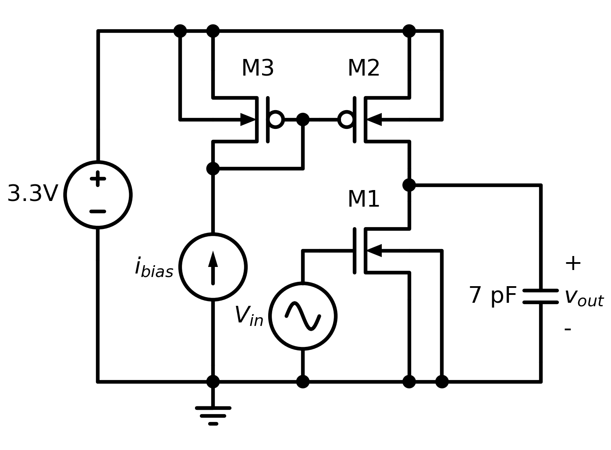
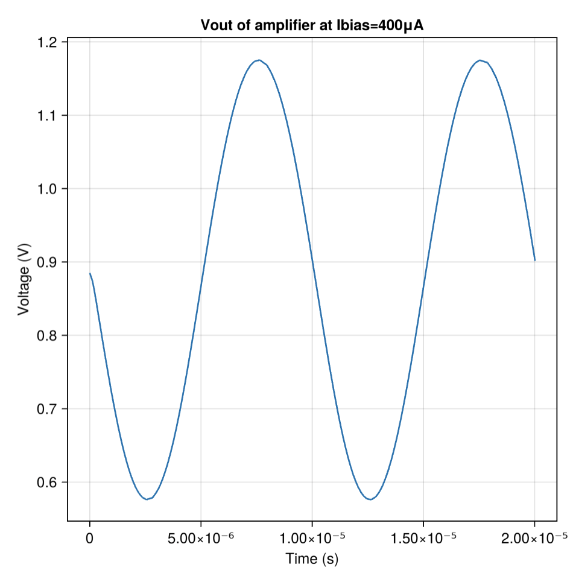
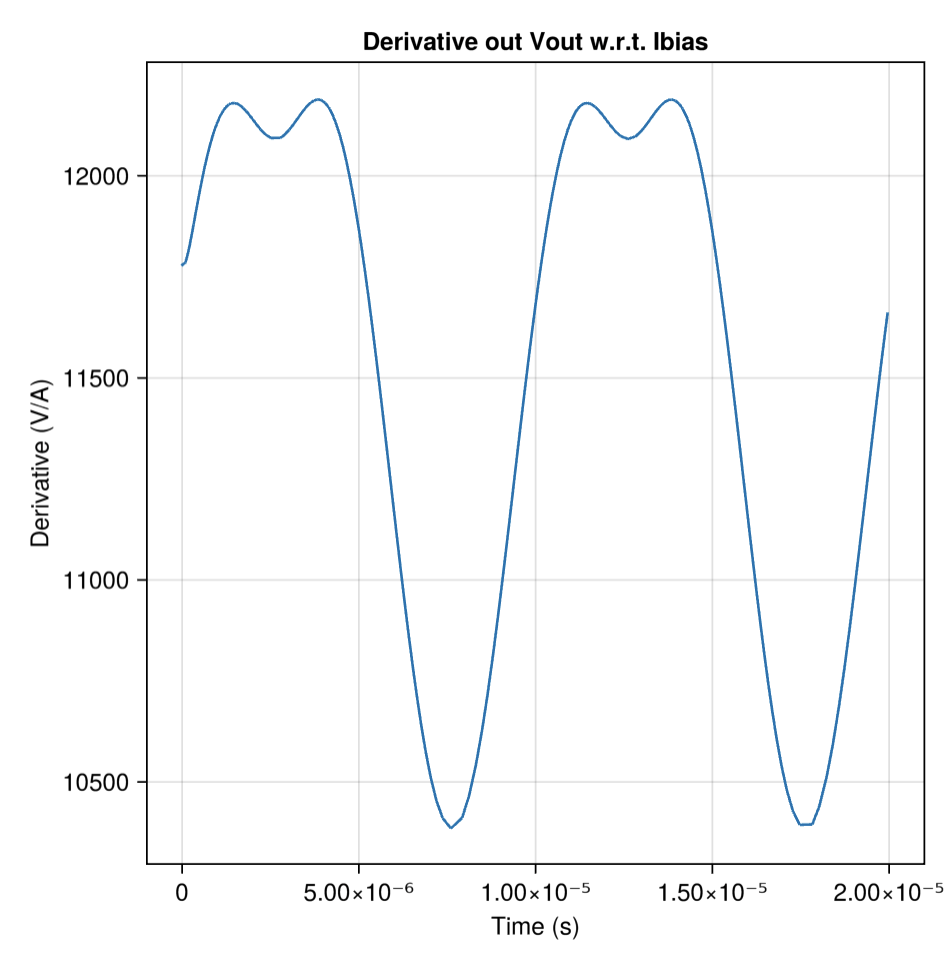
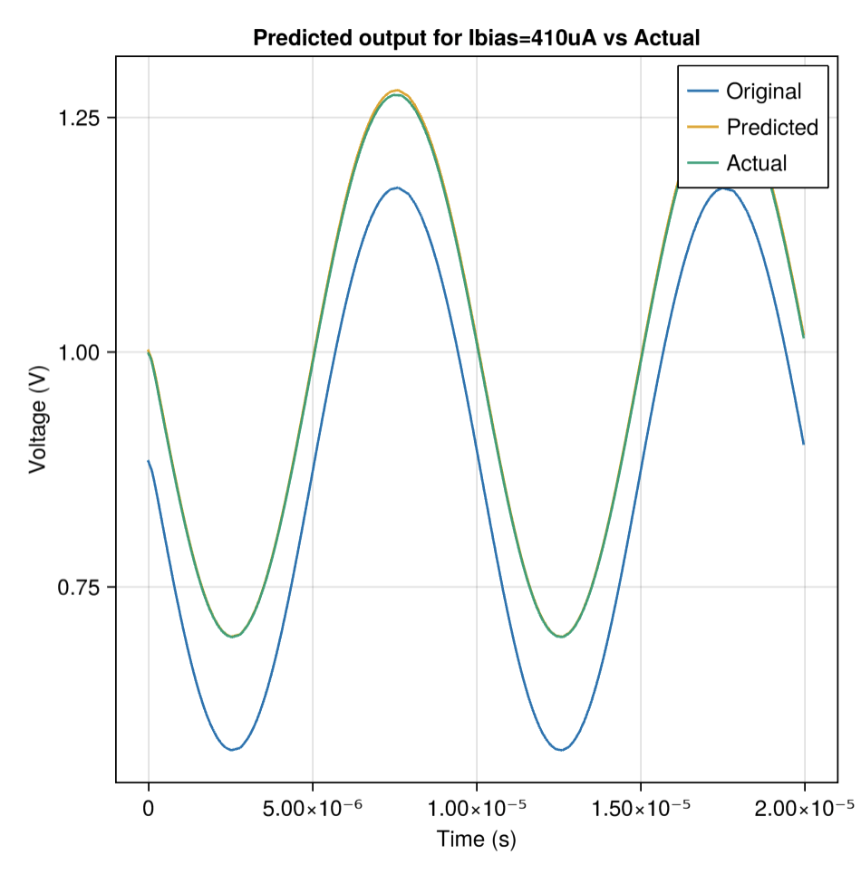

# Biased Amplifier

## Introduction

This circuit demonstrates a simple 3-transistor biased amplifier circuit.

The schematic is shown above, for most of this example we will concern ourselves primarily with the behavior of the `vout` net.
This amplifier is sensitive to the bias current, and so we will investigate the sensitivity of `vout` to the value of the `bias_current` parameter, which parameterizes the current flowing through `ibias`.

## Files

 - [`amplifier_sensitivity.jl`](./amplifier_sensitivity.jl) - simulation harness
 - [`amplifier.spice`](./amplifier.spice) - circuit netlist

## Analyses

### Transient

The first result plotted in the example is the voltage of the `vout` net when `ibias` is set to `400μA`.
Because the design is driven by a sinusoidal voltage source on `vin`, the output is merely a scaled version of that sinusoid, with some added minor nonlinearities that are not easily visible at this scale.

### Sensitivity

The example then goes on to show the sensitivity (e.g. the derivative) of `node_vout` with respect to the bias current.
This is one of the values that is calculated via `sensitivities!()`, accessible as an array of solutions (one for each parameter sweep point), then broken out by which parameter the sensitivity is based on, then the output to calculate the sensitivity of.
In the example, this sums together as inspecting the value of `ssols[1].sensitivities.bias_current.node_vout`.

Finally, we verify that our derivative is reasonable by using the derivative to predict what `vout` would look like at `bias_current = 410μA`, then actually simulating it and plotting all three signals in one plot:

As can be seen, the predicted values are fairly accurate.

## API Reference
  - _Configuring Parameters_
     - [`CedarEDA.SimManager`](@ref)
     - [`CedarEDA.SimParameterization`](@ref)
     - [`CedarSim.ProductSweep`](@ref)
  - _Simulating_
     - [`CedarSim.tran!`](@ref)
