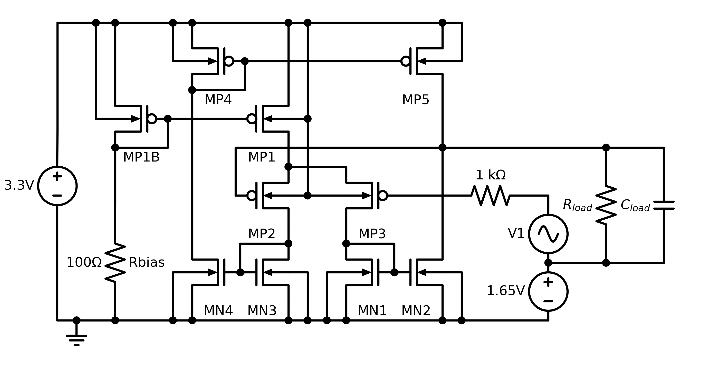
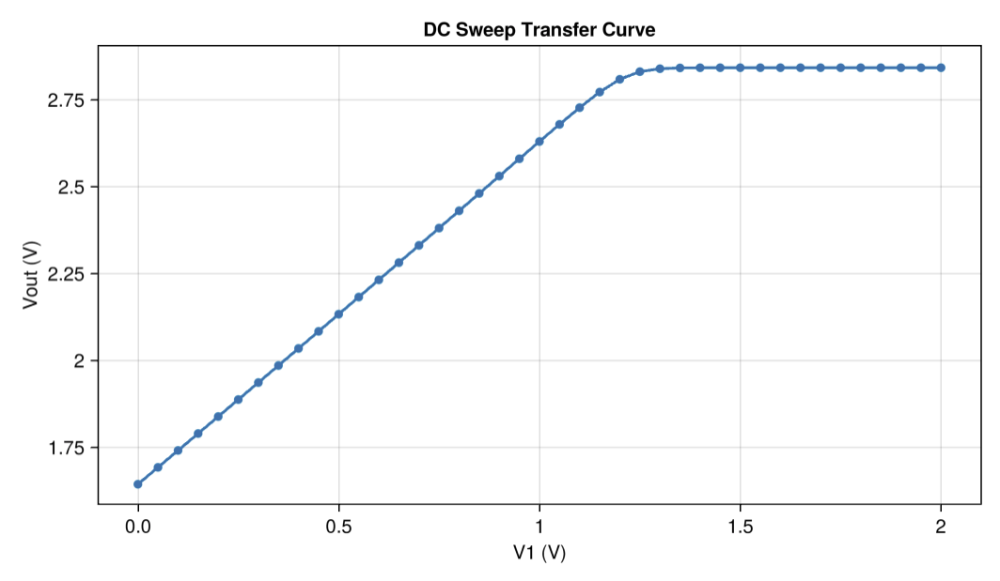

# [Operational Transconductance Amplifier (OTA)](@id op-amp-example)

## Introduction

An operational transconductance amplifier (OTA) operates as a voltage-controlled current source. A differential input stage amplifies the voltage difference between its inputs, and the result is available as a current at the output. By varying the output impedance of the load, it's possible to control the amount of saturation seen by the amplifier.

The two-stage design (and device test harness) seen here come from the [FAC'14](https://www.em.cs.uni-frankfurt.de/index.php?id=130) benchmark suite.

## Files

 - [`ota_dc.jl`](./ota_dc.jl) - simulation harness
 - [`ota.spice`](./ota.spice) - circuit netlist

## Analyses

### DC

This example runs a DC sweep and shows that the output saturates at sufficiently high input voltages.

## API Reference
  - _Configuring Parameters_
     - [`CedarEDA.SimManager`](@ref)
     - [`CedarEDA.SimParameterization`](@ref)
     - [`CedarSim.ProductSweep`](@ref)
  - _Adding Checks_
     - [`CedarEDA.set_checks!`](@ref)
  - _Simulating_
     - [`CedarSim.dc!`](@ref)
