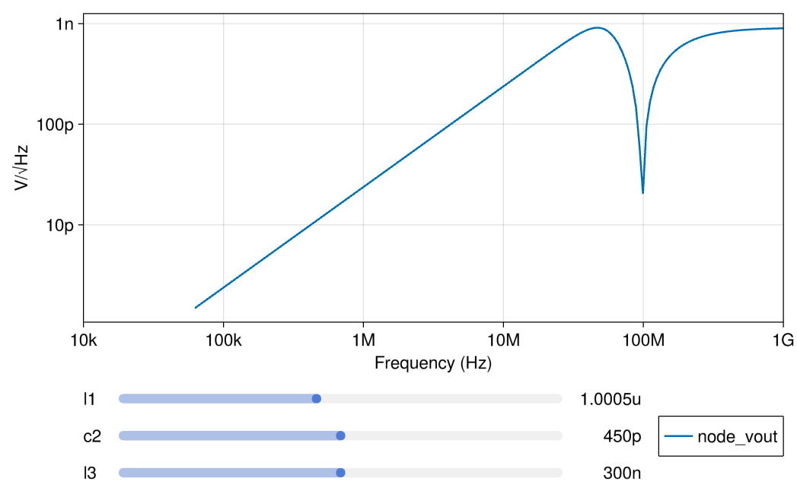

# [Butterworth third-order lowpass filter](@id butterworth-example)

## Introduction

This circuit demonstrates a Butterworth filter of third order, implemented with two inductors, a capacitor and a resistor.
The default parameter values are designed to give a cutoff frequency of 10 MHz, however with experimentation different cutoff frequencies and step responses are achievable.

In this circuit the input is a sinusoidal voltage source (with adjustable frequency) and the output is the filtered output, as shown in the attached circuit diagram.

The circuit netlist is contained within the [`butterworth.spice`](./butterworth.spice) file in this directory.
To begin running the simulation harness, open the [`butterworth_transient.jl`](./butterworth_transient.jl) or [`butterworth_ac.jl`](./butterworth_ac.jl) files and begin running statements.

## Files
 - [`butterworth.spice`](./butterworth.spice) - circuit netlist
 - [`butterworth_ac.jl`](./butterworth_ac.jl) - AC simulation harness
 - [`butterworth_noise.jl`](./butterworth_noise.jl) - AC noise simulation harness
 - [`butterworth_transient.jl`](./butterworth_transient.jl) - transient simulation harness

## Analyses

### Transient

Note that here we have a single measure applied (just as in the example)
disallowing the voltage to ever peak above the absolute maximum value above 1.1.

### AC

The AC response is calculated for a frequency sweep from 10 kHz to 1 GHz.
By moving the sliders the influence of each parametere can be understood.
`L1` is the primary component for controlling the passband ripple.

### Noise

The Noise spectrum is calculated for a frequency from 10 kHz to 1 Ghz.
By moving the sliders the influence of each parametere can be understood.

## API Reference
  - _Configuring Parameters_
     - [`CedarEDA.SimManager`](@ref)
     - [`CedarEDA.SimParameterization`](@ref)
     - [`CedarSim.ProductSweep`](@ref)
  - _Adding Checks_
     - [`CedarEDA.set_checks!`](@ref)
  - _Simulating_
     - [`CedarSim.ac!`](@ref)
     - [`CedarSim.tran!`](@ref)
     - [`CedarSim.noise!`](@ref)
  - _Inspecting Results_
     - [`CedarEDA.explore`](@ref)
