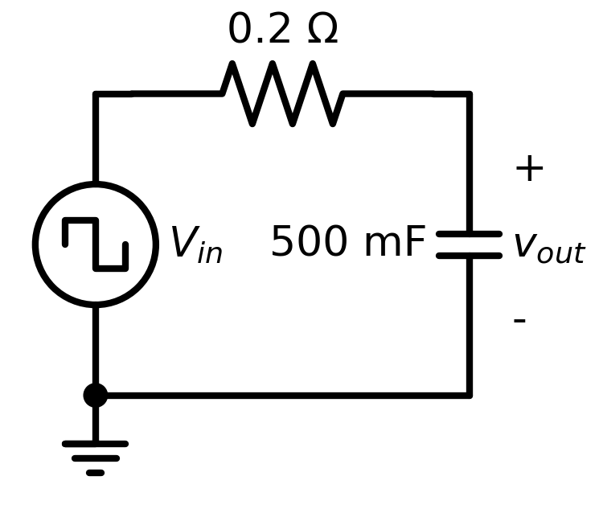
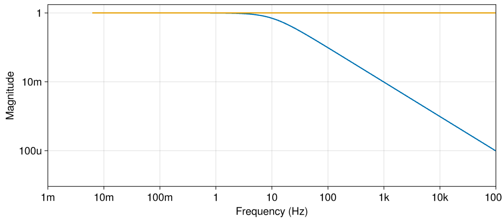

# [RC Circuit](@id circuit_diagram)



## Introduction

This circuit is a first-order R-C circuit, consisting of a resistor connected to a capacitor in series.

In this circuit the input is a pulsed voltage source alternating 1 second high at 1V and 1 second low at 0V, and the output is the voltage across the capacitor, as shown in the attached circuit diagram. The voltage across the capacitor slowly rises (and falls) inline with the voltage source. This risetime (and falltime) can be adjusted by tuning the resistor and capacitance.

The circuit netlist is contained within the [`rc.spice`](./rc.spice) file in this directory.
To begin running the simulation harness, open the [`rc.jl`](./rc.jl) file and begin running statements.

## Files

 - [`rc.jl`](./rc.jl) - simulation harness
 - [`rc.spice`](./rc.spice) - circuit netlist

## Analyses

### Transient

```@raw html

```

The example inspects the circuit first with a transient simulation ([lines 24-26](./rc.jl)).

Later as part of [Parameter Optimization](@ref), checks are added to this output, and the circuit parameters are optimized to minimize a loss function calculated on this transient response.

### AC



The example also runs an AC simulation ([lines 32-34](./rc.jl)).

### Parameter Optimization

Lastly, a risetime check is applied to the circuit ([lines 36-54](./rc.jl)), and parameter optimization is used to achieve a target value ([lines 56-80](./rc.jl)). The result is a set of optimized circuit parameters:

```julia
SimParameterization with parameterization:
 - c = 0.42394
 - r = 0.17009
Total: 1 simulations to sweep over., OptimizationInfo(retcode: Success
u: [0.17008805791728102, 0.42394232756315475]
Final objective value:     1.1234634056686136e-13
```

## API Reference
  - _Configuring Parameters_
     - [`CedarEDA.SimManager`](@ref)
     - [`CedarEDA.SimParameterization`](@ref)
     - [`CedarSim.ProductSweep`](@ref)
  - _Adding Checks_
     - [`CedarEDA.set_checks!`](@ref)
  - _Simulating_
     - [`CedarSim.ac!`](@ref)
     - [`CedarSim.tran!`](@ref)
  - _Inspecting Results_
     - [`CedarEDA.explore`](@ref)
