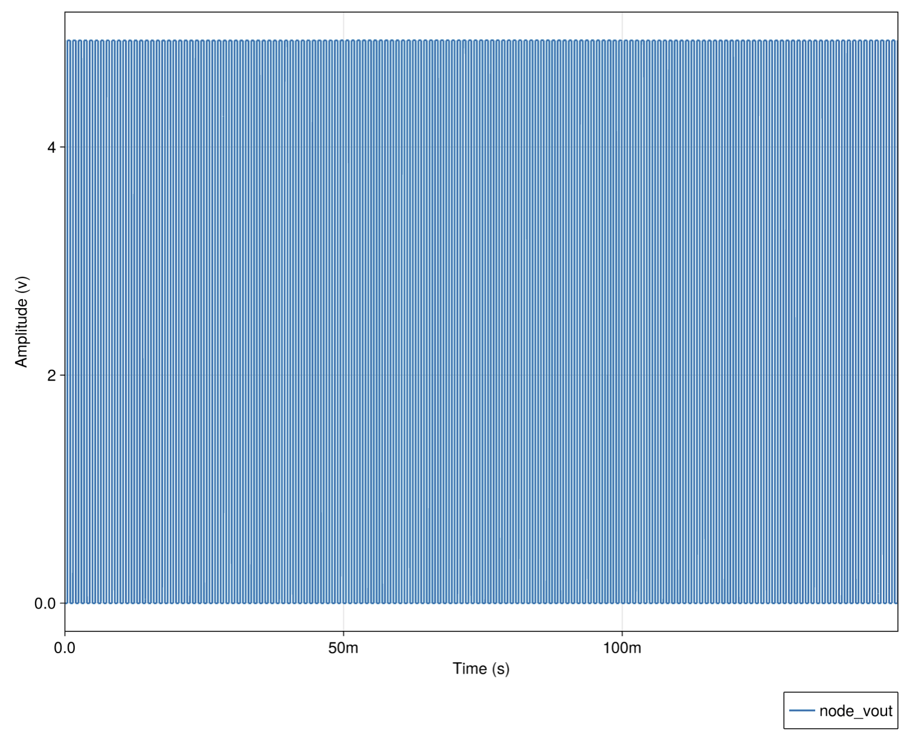

# CMOS Inverter

## Introduction

This circuit makes use of a pulse and a sinusoidal voltage source, fed through a CMOS inverter to generate a variable-width square wave.

This is primarily useful for generating somewhat realistic test sequences for use in downstream test writing (such as rising edge detectors, period detectors, etc...).

This script also demonstrates the "export to CSV" functionality built into CedarEDA.

## Files

 - [`variable_period_transient.jl`](./variable_period_transient.jl) - simulation harness
 - [`variable_period.spice`](./variable_period.spice) - circuit netlist

## Analyses

### Transient

The script runs a transient simulation at the default circuit parameters, which includes as inputs a "fast" square wave operating at 1 kHz summed with a "slow" sine wave at 10 Hz.

In this test, we've zoomed the X-axis in somewhat (hold the `X` key while click-and-dragging to zoom to restrict it to zoom only along the X-axis).

### CSV Export

Using the `export_csvs()` function, we export a moderately-sized `.csv` file (~50 MB) into the same directory as our script, containing the signals defined by our `set_saved_signals!()` methods in the script.

## API Reference
  - _Configuring Parameters_
     - [`CedarEDA.SimManager`](@ref)
     - [`CedarEDA.SimParameterization`](@ref)
     - [`CedarSim.ProductSweep`](@ref)
  - _Simulating_
     - [`CedarSim.tran!`](@ref)
  - _Exporting Results_
     - [`CedarEDA.export_csvs`](@ref)
