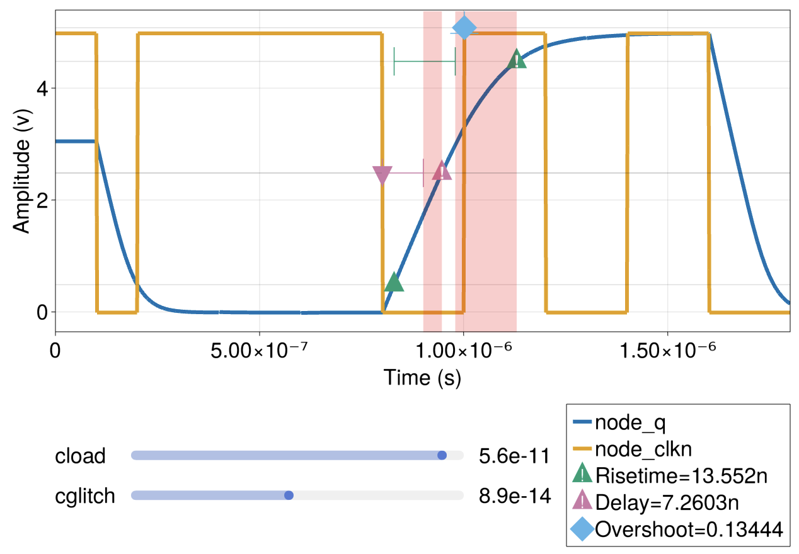

# GF180 D-type Flip Flop

## Introduction

This circuit demonstrates a negating D-type Flip Flop implemented on the Global Foundries 180nm process node.
This Flip-Flop acts as a memory cell, holding a single bit upon falling clock edge.
The bit is read in from the `D` node and constantly output upon the `Q` node.

In digital logic, the circuit can be represented as:

The circuit netlist is contained within the [`gf180_dff.spice`](./gf180_dff.spice) file in this directory.
To begin running the simulation harness, open the [`gf180_dff_transient.jl`](./gf180_dff_transient.jl) file and begin running statements.

## Files

 - [`gf180_dff_transient.jl`](./gf180_dff_transient.jl) - simulation harness
 - [`gf180_dff.spice`](./gf180_dff.spice) - circuit netlist
 - [`gf180mcu_fd_sc_mcu7t5v0__dffnq_4.ngspice`](./gf180mcu_fd_sc_mcu7t5v0__dffnq_4.ngspice) - detailed circuit netlist

## Analyses

### Transient

In this test we display only the clock and the output, as the input is not very interesting.
Note that we have three checks being displayed, showcasing a parameter configuration that breaks some of the constraints.

When running the `checks()` function, a tabular display of all parameter configurations is shown, CTRL-clicking (or CMD-clicking on Mac) on any of the cells will display that particular configuration in the plot pane.

## API Reference
  - _Configuring Parameters_
     - [`CedarEDA.SimManager`](@ref)
     - [`CedarEDA.SimParameterization`](@ref)
     - [`CedarSim.ProductSweep`](@ref)
  - _Simulating_
     - [`CedarSim.dc!`](@ref)
     - [`CedarSim.tran!`](@ref)
  - _Exporting Results_
     - [`CedarEDA.export_csvs`](@ref)
