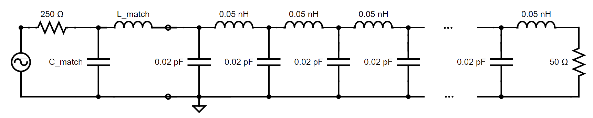
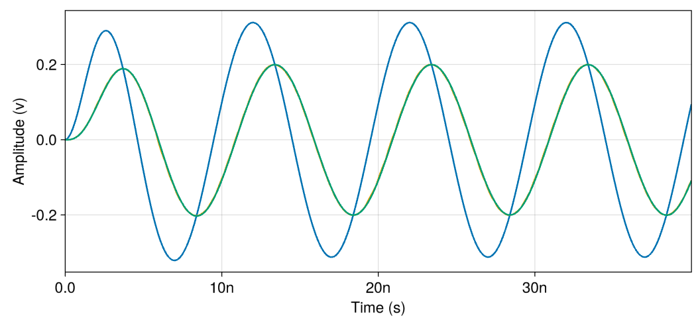
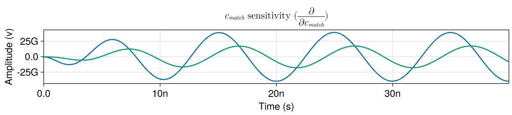

# Impedance Matcher

## Introduction

This circuit is a 250 Ohm voltage source connected to a transmission of 50 Ohms characteristic impedance via an impedance matching network (a basic L-section).

The fully matched values for L and C are 159.2nH and 12.73pF, respectively. These deliver maximum power to the load resistor.

The input is a periodic sine wave with a frequency of 10 MHz. The voltage is shown at the beginning and end of the transmission line (v\_in/v\_out), as well as at the 250 Ohm source (v\_src). If parameters are swept away from these ideal values, the voltage at v\_out will decrease, since the matched parameters maximize power.

The circuit netlist is contained within the [`impedance_matcher.spice`](./impedance_matcher.spice) and [`transmission_line.spice`](./transmission_line.spice) files in this directory.
To begin running the simulation harness, open the [`impedance_matcher_sensitivity.jl`](./impedance_matcher_sensitivity.jl) file and begin running statements.

## Files

 - [`impedance_matcher_sensitivity.jl`](./impedance_matcher_sensitivity.jl) - simulation harness
 - [`impedance_matcher.spice`](./impedance_matcher.spice) - circuit netlist
 - [`transmission_line.spice`](./transmission_line.spice) - transmission line sub-circuit netlist

## Analyses

### Transient

Before performing optimization, the example sweeps L and C values across 1nH to 200nH and 0.1pF to 20pF.

Inspecting the solution near 159.2nH and 12.73pF shows that vin and vout appear in the expected 2:1 ratio for maximal power delivery.

### Sensitivities

The script then performs a sensitivities simulation to show the relevant waveforms and intermediate derivatives. This plot shows the infinitesimal change in the transient response as the C parameter is changed.

Near the impedance matched solution, we expect this waveform to be 90 degrees out-of-phase with the transient solution. This quadrature relationship indicates that changing C would apply a phase shift to the output waveform but would not change its amplitude. Since the amplitude reaches a maximum at the impedance-matched solution, this is exactly what we'd expect.

### Parameter optimization

Then, it uses standard optimization tools (specifically, L-BFGS) to optimize the parameter values. The goal for the optimization is to automatically compute the parameters for an impedance matching network for the transmission line.

## API Reference
  - _Configuring Parameters_
     - [`CedarEDA.SimManager`](@ref)
     - [`CedarEDA.SimParameterization`](@ref)
     - [`CedarSim.ProductSweep`](@ref)
  - _Adding Checks_
     - [`CedarEDA.explore`](@ref)
  - _Simulating_
     - [`CedarSim.tran!`](@ref)
  - _Optimizing Parameters_
     - [`CedarEDA.optimize`](@ref)
  - _Inspecting Results_
     - [`CedarEDA.explore`](@ref)
